# Traducció de Adafruit Motor Shield V2 Created by lady ada
<https://learn.adafruit.com/adafruit-motor-shield-v2-for-arduino>

## Visió general

El kit original Adafruit Motorshield és un dels nostres kits més
estimats, per això vam decidir fer alguna cosa encara millor. Hem
actualitzat el kit per fer la més fàcil i millor manera de conduir
motors de corrent continu i pas a pas. Aquest escut farà més ràpid el
treball del vostre proper projecte de robòtica\! Vam mantenir la
capacitat de conduir fins a 4 motors de corrent continu o 2 motors pas a
pas, però va afegir moltes millores:

En lloc d’un controlador Darlington L293D, ara tenim els controladors
MOSFET TB6612 amb una capacitat de corrent de 1,2 A per canal (podeu
treure fins a un pic de 3A durant aproximadament 20 ms alhora). També té
caigudes de tensió molt més baixes al motor, de manera que obtingueu més
parell motor de les bateries i també hi ha díodes de retrocés integrats.

En lloc d’utilitzar un "latch" i els pins PWM d’Arduino, tenim un xip de
controlador PWM totalment dedicat a la placa. Aquest xip gestiona tots
els controls de motor i velocitat sobre I2C. Només dos pins GPIO (SDA i
SCL) més 5v i GND, es requereixen per conduir els múltiples motors i,
com que és I2C, també podeu connectar qualsevol altre dispositiu o escut
I2C als mateixos pins. Això també fa que sigui compatible amb qualsevol
Arduino, com ara Uno, Leonardo, Due i Mega R3.

Disseny completament apilable: 5 pins de selecció d’adreça signifiquen
fins a 32 escuts apilables: això són 64 motors pas a pas o 128 motors de
corrent continua\! Què podríeu fer amb tants motors? No en tinc ni idea,
però si se t’acudeix alguna cosa envia’ns una foto perquè seria un
projecte bastant gloriós.

Moltes altres petites millores, com ara un FET de protecció de polaritat
als pins d’alimentació i una gran àrea de prototipatge. I l’escut es
munta i es prova aquí a Adafruit, de manera que tot el que heu de fer és
soldar capçals rectes o apilats i els blocs de terminals. Tornem a
comprovar aquestes especificacions:

  - 2 connexions per a servos "hobby" de 5 V connectades al
    temporitzador dedicat d’alta resolució de l’Arduino, sense
    tremolar\!

  - 4 ponts H: el chipset TB6612 proporciona 1,2 A per pont (3 A per a
    pics breus de 20 ms) amb protecció d’apagada tèrmica, díodes de
    protecció contra retorns interns. Pot fer funcionar motors de 4,5VDC
    a 13,5VDC.

  - Fins a 4 motors de corrent continu bidireccional amb selecció
    individual de velocitat de 8 bits (per tant, una resolució
    d’aproximadament un 0,5%)

  - Fins a 2 motors pas a pas (unipolars o bipolars) amb bobina simple,
    doble bobina, intercalats o micropasos.

  - Motors desactivats automàticament a l’encesa.

  - Connectors grans del bloc de terminals per connectar fàcilment els
    cables (18-26 AWG) i 'alimentació

  - El botó de reinici d’Arduino apareix a la part superior

  - Bloc de terminals de 2 pins protegit per polaritat i pont per
    connectar energia externa, per a fonts de lògica/motor independents

  - Compatibilitat provada amb Arduino UNO, Leonardo, ADK/Mega R3,
    Diecimila i Duemilanove. Funciona amb Due amb pont lògic de 3,3 V.
    Funciona amb Mega/ADK R2 i anteriors amb 2 ponts de cable.

  - Baixeu la biblioteca de programari Arduino fàcil d’utilitzar,
    consulteu els exemples i ja esteu a punt\!

  - Nivells lògics compatibles de 5v o 3.3v - jumper configurable.

A partir d’Arduino 1.5.6-r2 BETA, hi ha un error a la biblioteca Due
Wire que impedeix que diversos Motor Shields funcionin correctament amb
el Due\!

## FAQ

❓ **Quants motors puc utilitzar amb aquest escut?**  
Podeu utilitzar 2 servos de corrent continu que funcionen amb 5 V i fins
a 4 motors de corrent continu o 2 motors pas a pas (o 1 pas a pas i fins
a 2 motors de corrent continu) que funcionen amb 5-12 VDC.

❓ **Puc connectar més motors?**  
Sí, apilant escuts\! Cada escut que apileu afegirà 4 motors de corrent
continu o 2 motors pas a pas (o 1 motor pas a pas més i 2 motors de
corrent continu més). No obtindreu més connexions de servo perqué els
contactes de servo van al pin \#9 i \#10 de l’Arduino.

❓ **Què passa si també necessito més servos?**  
Fes una ullada al nostre preciós escut de servo, també apilable amb
aquest escut de motor i afegeix 16 servos de funcionament lliure per
escut.  
<http://learn.adafruit.com/adafruit-16-channel-pwm-slash-servo-shield>

❓ **Amb quins Arduinos és compatible aquest escut?**  
S’ha provat per funcionar amb Duemilanove, Diecimila, Uno (totes les
revisions), Leonardo i Mega/ADK R3 i superior.  
Pot funcionar amb Mega R2 i inferior si soldeu un cable de pont des del
pin SDA de l’escut a Digital 20 i el pin SCL a Digital 21  
Per utilitzar-lo amb el Due o altres processadors de 3,3 v, heu de
configurar la placa per a nivells lògics de 3,3 v. Trobeu el conjunt de
3 coixinets etiquetats "Logic". Talla el petit rastre entre el coixinet
central i 5v i afegiu un pont de 3,3v al centre.

A partir d’Arduino 1.5.6-r2 BETA, hi ha un error a la biblioteca Due
Wire que impedeix que diversos Motor Shields funcionin correctament\!

❓ **Rebo el següent error en intentar executar el codi d’exemple:
"error: Adafruit\_MotorShield.h: No hi ha cap fitxer o directori…​".**  
Assegureu-vos que heu instal·lat la biblioteca Adafruit\_MotorShield

❓ **Com instal·lo la biblioteca?**  
Consulteu la pàgina del tutorial sobre el tema aquí
<http://learn.adafruit.com/adafruit-motor-shield-v2-for-arduino/install-software>

❓ **Quins motors pas a pas puc utilitzar amb l’escut?**  
El xip de controlador TB6612B són controladors de pont H amb un límit de
corrent continu d'1,2 A. No hi ha cap limitació de corrent activa, per
la qual cosa heu de triar un motor pas a pas que no intenti tirar més
que això. Per obtenir una explicació detallada, consulteu aquesta
[guia](https://learn.adafruit.com/all-about-stepper-motors/matching-the-driver-to-the-stepper)  
Una simple regla general és utilitzar un motor amb una resistència de
fase de 10 ohms o més. Això serà segur per a utilitzar amb tensions
d’alimentació de fins a 12 V.  
El motor NEMA 17 que tenim a la botiga té una resistència de fase d’uns
35 ohms, per la qual cosa és una bona combinació per a l’escut.

❓ **Puc utilitzar aquest motor NEMA-17?**  
NEMA-17 és només una designació de la mida del bastidor del motor. Ens
diu que el cos del motor és quadrat de 1,7". No ens diu res sobre les
característiques elèctriques. Haureu de conèixer almenys la resistència
de fase del motor per determinar la compatibilitat.  
Consulteu aquesta guia per obtenir-ne més detalls: [Matching the Driver
to the
Stepper](https://learn.adafruit.com/all-about-stepper-motors/matching-the-driver-to-the-stepper).

## Instal·lació de capçaleres estàndard

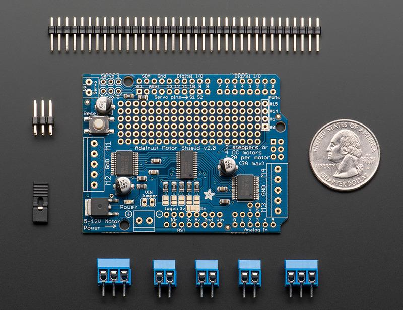

L’escut ve amb una capçalera estàndard de 0,1 ". La capçalera estàndard
no permet l’apilament, però és mecànicament més resistent i també són
molt menys cars\! Si voleu apilar un escut a la part superior, no feu
aquest pas perquè no és possible desinstal·lar les capçaleres un cop
soldades\! Vés a la part inferior del tutorial d’apilament.

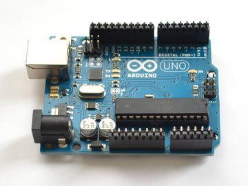

Trenca la capçalera de 0,1 "en peces llargues de 6, 8 i/o 10 pins i fes
lliscar els extrems llargs a les capçaleres del teu Arduino.

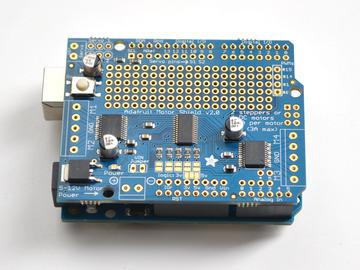

Col·loqueu l’escut muntat a la part superior de l’Arduino amb capçalera
de manera que totes les parts curtes de la capçalera s’enganxin a través
del conjunt exterior de pastilles

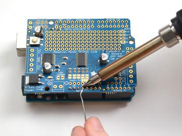

Soldeu cadascun dels pins a l’escut per fer una connexió segura

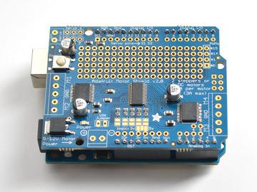

Això és\! Ara podeu instal·lar els blocs de terminals i el pont…​

## Instal·lació de blocs de terminals i molt més

Després d’haver instal·lat capçaleres normals o apilades, heu
d’instal·lar els blocs de terminals.

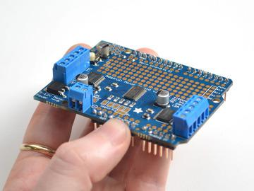

A continuació instal·larem els blocs de terminals. Així connectarem
l’alimentació i els motors a l’escut. Són molt més fàcils d’utilitzar
que la soldadura directa, només cal que utilitzeu un petit tornavís per
alliberar/connectar cables\!

Primer, però, els hem de soldar.

Feu lliscar els blocs de terminals de 3 pins en blocs de terminals de 2
pins de manera que tingueu 2 blocs de 5 pins i 1 de 2 pins. Els dos
conjunts de 5 pins van a banda i banda. La peça de 2 pins va prop de la
part inferior de l’escut. Assegureu-vos que els forats oberts dels blocs
de terminals estiguin mirant cap a fora\!

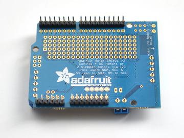

Gireu el tauler perquè pugueu veure i soldar els pins dels blocs de
terminals

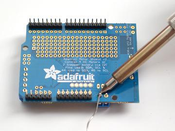

Soldar els dos pins del bloc de terminals d’alimentació externa

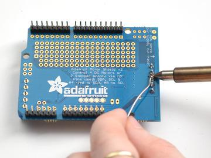

Soldar els dos blocs de motor, 5 patilles cadascun.

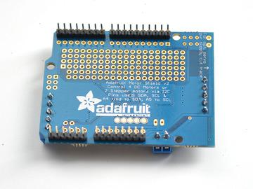

Això és tot per als blocs de terminals. A continuació, les connexions de
servo.

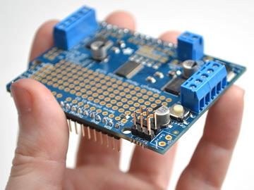

D’acord, a continuació, agafeu la capçalera de pins de 2x3 i
col·loqueu-la amb les cames curtes cap avall a la cantonada superior on
diu SERVO 1 i SERVO 2.

És possible que hi haja d’angular una mica la peça perquè s’adapte als
dos conjunts de forats de 3 pins. Ho vam fer perquè no caiga fàcilment
quan el gireu\!

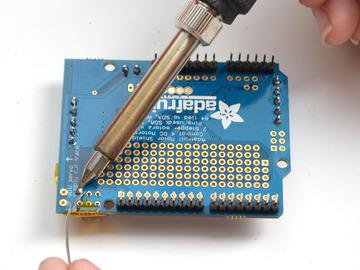

A continuació, gireu el tauler i soldeu els 6 pins

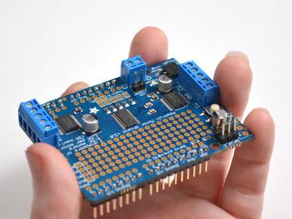

Finalment, trenqueu un tros de capçalera de 2 pins i col·loqueu-lo al
costat del bloc de terminals POWER, amb les cames curtes cap avall,
enganxeu-lo al seu lloc si cal i soldeu-lo.

## Instal·lació amb capçaleres per apilar

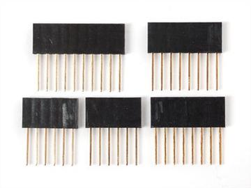

Haurà de comprar encapçalats d’apilament Arduino per a aquest pas,
l’escut no ve amb ells.

No mostrem la soldadura en l’encapçalat d’apilament de 2x3, però també
ha de soldar-ho; encara que aquest escut no l’usa, el de dalt pot
necessitar aqueixos pins\!

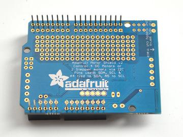

Comence lliscant els capçals d’apilament de 10 pins, 2 x 8 pins i 6 pins
en les files exteriors de l’escut des de la part superior. Després
voltege el tauler perquè descanse sobre els quatre encapçalats. Tire
dels pins si és necessari per a redreçar-los.

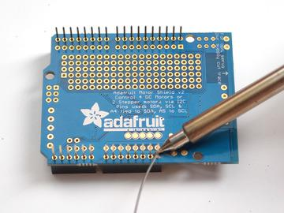

Soldar un pin de cada encapçalat per a col·locar-los en el seu lloc
abans de soldar més. Si els encapçalats es torcen, pot tornar a calfar
el pin mentre els torna a col·locar per a redreçar-los.

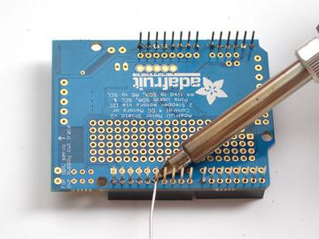

Una vegada que haja fixat i redreçat tots els blocs d’encapçalats, torne
i solde els pins restants per a cada bloc.

## Instal·lació del software

### Instal·lar Adafruit Motor Shield V2 library

Per a usar l'escut en un Arduino, haurà d'instal·lar la biblioteca Adafruit Motorshield v2. Aquesta biblioteca no és compatible amb la biblioteca AF_Motor anterior que s'utilitza per als escuts v1. No obstant això, si té un codi per a l'escut anterior, no és difícil adaptar el codi per a usar l'escut nou. Vam haver de canviar una mica la interfície per a admetre l'apilament d'escuts, i creiem que val la pena!

Per a començar a controlar motors, haurà d'instal·lar la [biblioteca Adafruit_Motor_Shield_V2_Library](https://github.com/ladyada/Adafruit_Motor_Shield_V2_Library) (codi en el nostre repositori de github). Està disponible en l'administrador de la biblioteca Arduino, per la qual cosa recomanem usar-lo.

Des del IDE, òbriga l'administrador de la biblioteca...